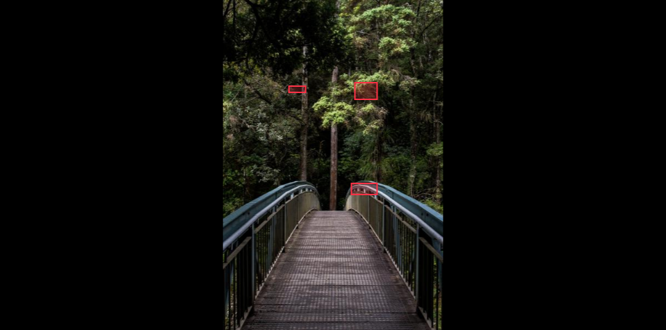

# AnnotationViewer

AnnotationViewer component display a document (image or pdf) and predictions on top of it using HTML Canvas.

This component use as much space as its parent allows on the page.

Size your parent according to your need, example:

```javascript
<div style={{ height: '50vh', width: '50vw' }}>
  <AnnotationViewer source={myFile} predictions={[]} type='image' />
</div>
```

## Basic usage

Let's start with a minimal react example using a javascript variable (called here `forest`) containing an image in a base64 string. This file can be found in `example/src/imgs`.

Let's fake an API response using helpers from this SDK.

```javascript
import React, { useState } from 'react'

import { AnnotationViewer, fakeResponse, formatPredictions, flattenShapesPredictions } from 'react-mindee-js'
import forest from './imgs/forest'

const App = () => {
  const predictions = fakeResponse
  const formattedPredictions = formatPredictions(predictions)
  const shapes = flattenShapesPredictions(formattedPredictions)

  return (
    <main>
      <div style={{ height: '50vh', width: '50vw' }}>
        <AnnotationViewer source={forest} type="image" predictions={shapes} />
      </div>
    </main>
  )
}
```

Here is the result:



## Example with PDF files

todo...

## Passing context as props

todo...

## Passing custom settings

todo...


***links to AnnotationWrapper documentation file
